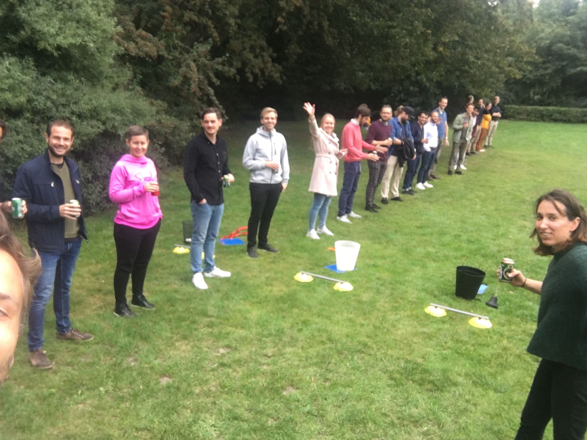

# Cypress Introduction
#### Mohsen Asfia
##### Service Delivery - Container Flow Optimization
##### Ace (Automated Cargo Execution)


### Miss you all!



# test


## Table content
- Cypress Overview
- How to Setup?
- Cypress Project Structure
- Cypress Common Commands
- Cypress Advanced Commands
- Tricks to More Efficient Selectors
- Aliases


- Custom Commands
- Cypress & Command Line
- Page Object Model
- Fixtures
- Interaction with Files
- Testing APIs
- Cypress UI


## Overview
- https://docs.cypress.io/guides/overview/why-cypress.html#In-a-nutshell
- Frontend testing tool
- Open source
- Unit, integration and e2e

Note: Cypress also offers you a dashboard which can be used to manage the test results and snapshots, etc, but it's subscription based.


 - JS 
 - Mocha
 - Chai

Note: 
- JS: Scripts are written in JS.
- Mocha is the testing framework.
- Chai is the assertion library.
- It's different from selenium, it runs remote commands through network but cypress runs in the same loop as the application which enables us to be able to for instance stub the Dom api


### Nice Features
- Time travel
- Real time reload
- Spies, stubs and clocks
- Debuggability
- Automatic waiting
- Network traffic control
- Screenshots and videos

Note:
- Time travel: it screenshots as the test runs
- Real time reload: it automatically re-runs your tests whenever you make changes to it
- Spies, stubs and clocks
- Debuggability readable errors and stack traces, no more guess why the tests are failing
- Automatic waiting, it automatically waits for tests and assertions to run, so no longer need for writing sleep and waits on our own
- Network traffic control, we can easily control, stub and test edge cases without involving our server, you can stub network traffic however you like
- Screenshots and videos: Screenshots are taken on failure and videos of our entire test suite are recorded


## Cypress Project Structure
``` [1|2|3|4|5|6|7|8|9|10]
cypress   
└───fixtures
└───integration
└───plugins
└───support
│   │   index.js
│   │   commands.js
└───videos
└───page-objects
|   cypress.json
```

Note:
- fixtures: Holds external pieces of static data which can be used by our tests
- integration: It does all the heavy lifting all the test files are located here
- plugins: where we can import and load our plugins through the index.js file
- support: which contains commands.js and index.js:
  `index.js` is to store global configs and behaviours which modifies cypress
  `commands.js` is to make custom commands or to override existing commands
- cypress.json which contains project configurations, base url, environment specific configs and so on
- cypress uses mocha framework so tests start with a describe and then one or more ‘it’. Describe contains collection of tests


## Setting Up Cypress
As simple as 
```bash 
npm install cypress 
```


### Before Cypress

Note: 
- whereas before cypress you would need to choose ...


- Framework
  - Mocha
  - Jasmine
  - QUnit
  - Karma


- Assertion library
  - Chai
  - Expect.js


- Install selenium    
  - Protractor
  - Nightwatch
  - Web driver

Note: 
- Install selenium and choose a selenium wrapper like:


- Additional libraries
	- Sinon
	- TestDouble

Note: 
```bash
mkdir test-project
```
```bash
cd test-project
```
```bash
code .
```
Open terminal and run: 
```bash
npm init
```
Which is used to manage the project dependencies in order to create `package.json` 


## Common Cypress Commands


```js
cy.visit('/');
```

Note:
is a command to launch a web application


```js
cy.get('input[type="email"]')
```

Note:
is to select an element which will look for an element with the properties that we write


```js
cy.get('input[type="email"]').type('mohsen.asfia@maersk.com')
```

Note:
is to type into an element


```js
cy.get('.btn').contains('User profile')
```

Note:
- it means select all .btn but only the ones that has a label of ‘User profile’


```js
cy.get('.btn').should('be.visible')
```

Note:
Test doesn’t have to have an assertion, cypress has builtin assertions for instance visit checkes that the content is html and status is 200, cy.get asserts if the element exists and cy.get().contains asserts if a particular element exists and .click() verifies if the element is in an actionble state.
should(‘be.visible’) —> is to check element exists and visible


```js
cy.get('.btn').text()
```

Note:
In order to verify text withing an element.


## More Advanced Cypress Commands


### Page Title
```js
cy.title().should('eq', 'hello world')
```


### URL Protocol
```js
cy.location('protocol').should('eq', 'https')
```


### Verify We're In a Correct Page
```js
cy.contains('your feed').should('be.visible')
```

Note:
- To verify that we’re in a correct page for instance


### Change The Timeout on a Command
```js
cy.contains('your feed', { timeout: 10000 }).should('be.visible')
```

Note:
`contains` and `get` function do have a default timeout of 4 seconds if it exceeds that amount then it will fail, meanwhile the second parameter is to extend


### Verify The URL Hash
```js [1|2]
cy.hash().should('include', '#/editor')
cy.location('hash').should('include', '#/editor')
```

Note:
to verify a url hash we can use the command hash


### Current URL of The Application
```js
cy.url().should('include', 'article')
```


### Navigate in Browser History
```js [1|2|3]
cy.go('back')
cy.go(-1)
cy.reload()
```


## Tricks to more efficient selectors


### within()
```js [1|2|3]
cy.get('form').within(($form) => {
  cy.get('input[type="email"]')… //=> looks only within the contentext of the selected form
  cy.root().submit() //=> will submit the form
});
```


### children()
```js [1|2|3|4|5|6]
cy.get('.nav-bar').children().contains('click') // => children() willl return all children of an element
                  .parent()
                  .parentsUntil()
                  .sibling()
                  .prev()
                  .next()
```


### first(), last(), eq()
```js [1|2|3|4]
cy.get('.btn-search').first()
                     .last()
                     .eq(1) // == first 
                     .eq(2) // == second
```


## Custom Command
In `commands.js`
```js
Cypress.Commands.add('login', () => { ... });
```


### Consumption
```js [2|3]
describe('fave icon', () => {
  beforeEach(()=> {
    cy.login();
  });
  it('click on fave icon should add the item to the favorite items', () => { ... });
})
```


Mocha hooks
  - before()
  - after()
  - beforeEach()
  - afterEach()


## Key Configurations
- baseUrl
- port
- timeout
- default folders:
  - fixtures
  - tests
  - snapshots
- Browser settings
- Configure the viewport


### Overriding global configs for a specific test
```js [3]
describe('fave icon', () => {
  beforeEach(()=> {
    cypress.config('pageLoadTimeout', 10000)
  });
  it('click on fave icon should add the item to the favorite items', () => { ... });
})
```

Note:
- With `cypress.config()` you can override configurations in cypress config file
- In cypress UI if you go to settings tab there you can see all configurations applied to your cypress


## .then(() => { ... }) command
```js
cy.get('form').then(($form) => {
  $form.get('input[type="email"]');
  // ...
});
```


### Can Be Used For
- Debugging
- Compare before and after
- When working with aliases in order to share context


## Aliases
```js [2|6|11]
describe('a suite', () => {
  let text;

  beforeEach(() => {
    cy.button().then(($btn) => {
      text = $btn.text()
    })
  })

  it('does have access to text', () => {
    text
  })
})
```

Note:
- We alias elements so we can access and re-use them.
- Re-use Dom elements: the object that we receive in the then command is only available within the then function but what if we wanna access it later?
- This creates a closure around `text` so we can access it.
- Redefine text reference
- Now text is available to us, but this is not a great solution :(


```js [2|6]
beforeEach(() => {
  cy.get('button').invoke('text').as('text')
})

it('has access to text', function () {
  this.text // or cy.get('@text')
})
```

Note:
- Alias the $btn.text() as `text`
- Is now available


## Run Cypress from Command Line


```bash
npx cypress run
```


### All Spec Files in a Specific Folder
```bash
npx cypress run —spec 'test/examples/**/*'
```


### Only
```js [12]
describe('Unit Test FizzBuzz', () => {
  beforeEach(() => {
    cy.login();
  });

  function numsExpectedToEq (arr, expected) {
    arr.forEach((num) => {
      expect(fizzbuzz(num)).to.eq(expected)
    })
  }

  it.only('returns "fizz" when number is multiple of 3', () => {
    numsExpectedToEq([9, 12, 18], 'fizz')
  })

  it('returns "buzz" when number is multiple of 5', () => {
    numsExpectedToEq([10, 20, 25], 'buzz')
  })

  it('returns "fizzbuzz" when number is multiple of both 3 and 5', () => {
    numsExpectedToEq([15, 30, 60], 'fizzbuzz')
  })
})
```

Note:
Will only run that test in that file but hooks will be always executed


### Skip
```js [12]
describe('Unit Test FizzBuzz', () => {
  beforeEach(() => {
    cy.login();
  });

  function numsExpectedToEq (arr, expected) {
    arr.forEach((num) => {
      expect(fizzbuzz(num)).to.eq(expected)
    })
  }

  it.skip('returns "fizz" when number is multiple of 3', () => {
    numsExpectedToEq([9, 12, 18], 'fizz')
  })

  it('returns "buzz" when number is multiple of 5', () => {
    numsExpectedToEq([10, 20, 25], 'buzz')
  })

  it('returns "fizzbuzz" when number is multiple of both 3 and 5', () => {
    numsExpectedToEq([15, 30, 60], 'fizzbuzz')
  })
})
```


### Launching browser
```bash
npx cypress run --browser firefox
```

Note:
- Cypress automatically detects available browsers on your OS
- You can also do that in the Cypress UI


#### Currenlty supported browsers
- Canary
- Chrome
- Chromium
- Edge
- Edge Beta
- Edge Canary
- Edge Dev
- Electron
- Firefox (Beta support)
- Firefox Developer Edition (Beta support)
- Firefox Nightly (Beta support)


## Page Object Model
``` [4|9]
cypress   
└───fixtures
└───integration
│   │   search.spec.ts
└───plugins
└───support
└───videos
└───page-objects
│   │   search.object.ts
|   cypress.json
```


```js [1-2|5-7|10-12]
const BRANDS_FILTER_FIELD = '[data-test-brands-filter-field] input';
const PORT_CALL_RESULT_ITEM = '[data-test-port-call-result-item]';

export class SearchPage {
  static visit() {
    cy.login().then(() => cy.visit('/'));
    cy.server();
  }

  static typeInBrandsFiilter(query) {
    cy.get(BRANDS_FILTER_FIELD).type(query);
  }

  static getFirstPortCallResultItem() {
    return cy.get(PORT_CALL_RESULT_ITEM).first();
  }
}
```

Note:
We split the elements into different files based upon the page they appear on


### Consumption of a Page Object Model
```js [5|9|13-15]
import { Given } from 'cypress-cucumber-preprocessor/steps';
import { SearchPage } from '../../page-objects';

Given(`I open the port call search page`, () => {
  SearchPage.visit();
});

When(`I type mmc into the brands input and press Enter`, () => {
  SearchPage.typeInBrandsFiilter('mmc {enter}');
});

Then(`Every port call item in the results section should contain the selected regional brand in their href as a query param`, () => {
  SearchPage.getFirstPortCallResultItem()
    .should('have.attr', 'href')
    .and('match', /regionalBrands=code:MCC/);
});
```


## Fixtures 
``` [3]
cypress   
└───fixtures
│   │   credentials.json
└───integration
│   │   search.spec.ts
└───plugins
└───support
└───videos
└───page-objects
|   cypress.json
```


### credentials.json
```js
{
  "username": "foo",
  "password": "cafe"
}
```


### Integration
``` [5]
cypress   
└───fixtures
│   │   credentials.json
└───integration
│   │   login-page.spec.ts
└───plugins
└───support
└───videos
└───page-objects
|   cypress.json
```


### search.spec.ts
```js [6|10]
import { Given } from 'cypress-cucumber-preprocessor/steps';
import { LoginPage } from '../../page-objects';

Given(`I open the login page`, () => {
  LoginPage.visit();
  cy.fixture('cerdentials').alias('credentials');
});

When(`I type my username into the login form and press Enter`, () => {
  LoginPage.typeInUsername(`${this.credentials.username} {enter}`);
});

//...
```


## Interacting with Files


### Write to a file
```js
	cy.writeFile('hello-world.txt', 'hello world!!', {flag: 'a+' })
```


### Read from a file and verify
```js
	cy.readfile('hello-world.txt').should('contains', 'hello world')
```


## Testing APIs

Note:
Cypress makes http requests with cy.request command.


### Get
```js
cy.request('GET', 'http://google.com/api/places?id=2000')
```

Note:
Get is the. Default method and no need. To provide it


### Inspecting The Response Object
```js [2|3|4]
cy.request('GET', 'http://google.com/api/places?id=2000').then((response) => {
    expect(response).to.have.property('status', 200);
    expect(response.body).to.not.be.null;
    expect(response.body.data).to.have.length(20);
});
```

Note:
`Then` function we can assert for instance the. status code, or inspect length of a property, or existance of a property, etc.


### Post
```js [1|2|3|4]
cy.request('post', 'http://google.com/api/places', newPlaceItem)
  .its('body')
  .its('data')
  .should('deep.eq', newPlaceItem)
```


```js [4]
cy.request('post', 'http://google.com/api/places', newPlaceItem)
  .its('body')
  .its('data')
  .should('include', { name: 'Copenhagen' })
```


### Stubbing

#### Enable Stubbing
```js [1|2-6|3|4|5]
cy.server()           
cy.route({
  method: 'GET',      
  url: '/users/*',    
  response: []        
})
```

Note:
- Enable response stubbing
- Route all GET requests
- That have a URL that matches '/users/*'
- And force the response to be: []


#### Mock The Response
```js [1|3|4]
cy.server()

cy.fixture('activities.json').as('activitiesJSON')
cy.route('GET', 'activities/*', '@activitiesJSON')
```


#### Wait for All Requests to Resolve
```js [1-2|4|6|8]
cy.server()

cy.route('activities/*', 'fixture:activities').as('getActivities')
cy.route('messages/*', 'fixture:messages').as('getMessages')

cy.visit('http://localhost:8888/dashboard')

cy.wait(['@getActivities', '@getMessages'])

cy.get('h1').should('contain', 'Dashboard')
```

Note:
- Visit the dashboard, which should make requests that match the two routes above
- Pass an array of Route Aliases that forces Cypress to wait until it sees a response for each request that matches each of these aliases
- These commands will not run until the wait command resolves above


#### Verify Multiple Requests
```js [8-10|12-14|16-18]
cy.server()
cy.route({
  method: 'POST',
  url: '/myApi',
}).as('apiCheck')

cy.visit('/')
cy.wait('@apiCheck').then((xhr) => {
  assert.isNotNull(xhr.response.body.data, '1st API call has data')
})

cy.wait('@apiCheck').then((xhr) => {
  assert.isNotNull(xhr.response.body.data, '2nd API call has data')
})

cy.wait('@apiCheck').then((xhr) => {
  assert.isNotNull(xhr.response.body.data, '3rd API call has data')
})
```


#### Autocomplete Example
```js [2|4|6|8-10]
cy.server()
cy.route('/search*', [{ item: 'Book 1' }, { item: 'Book 2' }]).as('getSearch')

cy.get('#autocomplete').type('Book')

cy.wait('@getSearch')

cy.get('#results')
  .should('contain', 'Book 1')
  .and('contain', 'Book 2')
```

Note:
- Our autocomplete field is throttled meaning it only makes a request after 500ms from the last keyPress
- Wait for the request + response thus insulating us from the throttled request


#### Autocomplete Example with Inspecting the XHR Object

```js [7]
cy.server()
cy.route('search/*', [{ item: 'Book 1' }, { item: 'Book 2' }]).as('getSearch')

cy.get('#autocomplete').type('Book')

cy.wait('@getSearch')
  .its('url').should('include', '/search?query=Book')

cy.get('#results')
  .should('contain', 'Book 1')
  .and('contain', 'Book 2')
```

Note:
- This yields us the XHR object which includes fields for request, response, url, method, etc


##### Multiple assertion on XHR object with a single "should" callback
```js [2|4|6-7|9-15|10|17-27|21]
cy.server()
cy.route('POST', '/users').as('new-user')

cy.get('.btn-add-new-user').click();

cy.wait('@new-user')
  .should('have.property', 'status', 201)

cy.get('@new-user') 
  .its('requestBody') // alternative: its('request.body')
  .should('deep.equal', {
    id: '101',
    firstName: 'Joe',
    lastName: 'Black'
  })

cy.get('@new-user')
  .should((xhr) => {
    expect(xhr.url).to.match(/\/users$/)
    expect(xhr.method).to.equal('POST') 
    expect(xhr.response.headers, 'response headers').to.include({
      'cache-control': 'no-cache',
      expires: '-1',
      'content-type': 'application/json; charset=utf-8',
      location: '/users/101'
    })
  })
```

Note:
- We can grab the completed XHR object again to run more assertions using cy.get(<alias>)
- Yields the same XHR object
- And we can place multiple assertions in a single "should" callback
- It is a good practice to add assertion messages as the 2nd argument to expect()


## Open Cypress UI
In order to run cypress locally
```bash
npx cypress open
```

Note:
- Cypress UI lists all the test files that we’ve created clicking on any of them will show the test runner which consists of:
- Command log
- Application preview
- Header
- Selector playground which helps you to identify the elements on the page and then you’d be able to copy the command and use it in your tests.


## What's coming up next week?
- Authentication with Azure/AD
- Integration with CI/CD pipeline using AzureDevops
- Integration with Cucumber


## Thank you for your time and feel free to reach out if you have any questions :-)
##### Reach me on Slack @mohsen asfia 