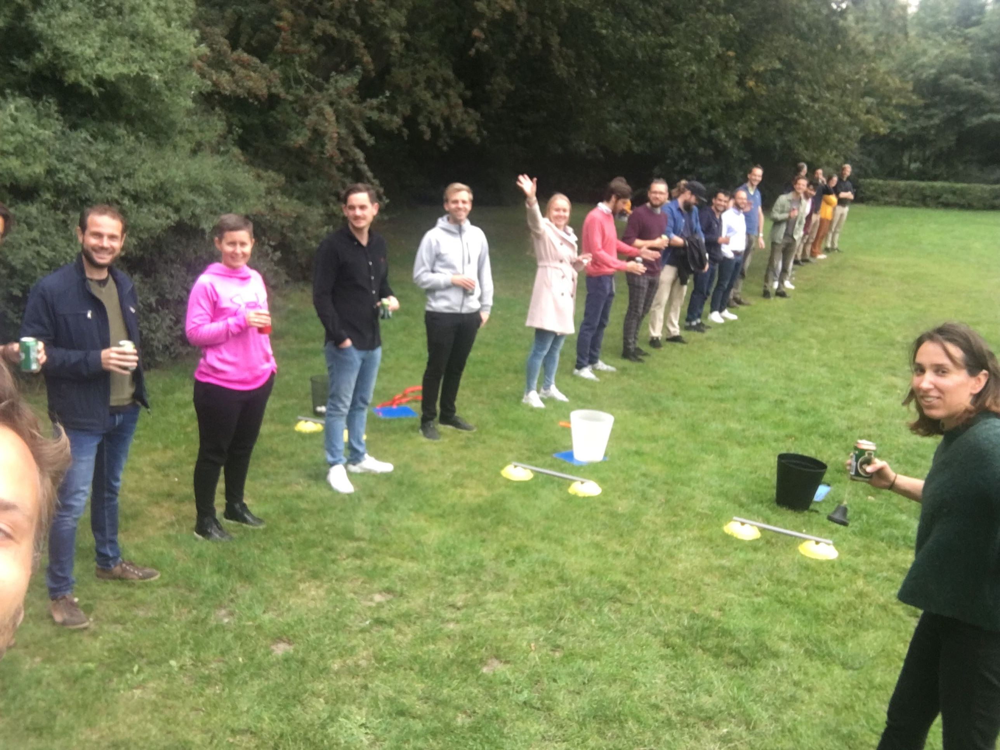

# Azure DevOps Monorepo CI pipeline using NX
#### Mohsen Asfia
##### Nucleus
##### Sky (former Ace team)


### Miss you all! 



## Table content
- Misconceptions about Monorepo
- Monorepo !== Monolith
- NX
- Chanllenges with NX or Monorepo
- CI solution


## Misconceptions about Monorepo
- It forces us to release together. Monoliths are bad.​
- It lets other teams changing my code without me knowing.​
- It creates a big ball of mud. It makes applications hard to understand and maintain.​
- We all need to release together!


## Monorepo !== Monolith
- Tools to only rebuild/retest/relint whatever is affected
- Simplify code sharing and cross-project refactorings
- Significantly lower the cost of creating libs, microservices and microfrontends
- Dependency managment!

Note:
- Should we expect to wait 5 hours for the CI build??​ Yes rebuilding everything is slow, but monorepo gives you tools to only rebuild/retest/relint whatever is affected.
- Simplify code sharing and cross-project refactorings
- Significantly lower the cost of creating libs, microservices and microfrontends
- Dependency graph, or defining some constraints to make a library invisible some other specific libraries, so only few libs can import that


## NX (nx.dev)
- Made by Nrwl
- Extension to Angular CLI

Note: 
- They provide tips and tactics to optimize Angular for the enterprise applications and softwares.
- Just an extension to angular cli for multiple apps.​


### Core elements of NX
- Nx workspace
- One singular `package.json`
- `Affected`
- CLI tools for the structure of Monorepo
- Dependency graph

Note: 
- Nx workspace consists of apps and libs.​
- Same package.json for the whole workspace, upgrade Typescript and it will be upgraded for everybody, Google and Facebook already using this approach.​
- `Affected` Looks at your changes and only evaluates the affected modules
- A lot of CLI tools for making components, libs, container components, NgRx modules and services in the structure of monorepo (nx). ​
- Tool chain


​
### Benefits of NX ...
- Making a new app in a matter of seconds
- Build a platform
- Everything at that current commit works together!
- Easy to split code into composable modules​
- Easier dependency management​
- One toolchain setup​
- Code editors and IDEs are “workspace” aware​

Note:
- Everything at that current commit works together. Changes can be verified across all affected parts of the organization.​


### ... Benefits of NX
- Consistent developer experience​
- Allows you to set up precise ownership policies​
- Provide more structure to your source code​
- Scale well using familiar tools


### Benefits of Monorepo in the context of `Nucleus`
- Much stronger and sustainable frontend platform.​
- It brings frontenders more together
- Knowledge sharing
- Pull requests get reviewed faster
- Increases level of sharing code​
- One singular `package.json`, no more need to upgrade things in zilions of places!
- Easier for frontenders to switch and help other teams

Note:
- It brings frontenders more together, doing pull requests for each other and working more closely together. 
- Pull requests get reviewed faster as there're more frontenders who can review a code change.​
- Increases level of sharing code and lowers the cost with producing re-usable modules and producing new apps.​
- One singular `package.json`, no more need to upgrade things in zilions of places like every projects, core-ui, common-ui, etc. One developer do it in the same amount of time and it benefits the whole department.​
- Easier for frontenders to switch and help other teams if they are in need of an extra hand at some point.


## Chanllenges with NX or Monorepo
- Branching strategies
- Pull requests
- CD strategy?
- CI setup -> today's agenda
- Backward compatibility

Note:
- One singular master branch, or a branch for every project?
- Requires more sophisticated CI setup​
- Backward compatibility: 
  - Trunk-based development is a lot more important​
  - Requires you to think about large-scale changes

## CI solution


### Final solution


#### Project structure
``` [1-11]
NX workspace   
└───apps
│   └───ace
│   │   │   build-pipeline.yaml
│   └───ace-admin
│   │   │   build-pipeline.yaml
│   └───alfred
│   │   │   build-pipeline.yaml
└───libs
|   package.json
|   build-pipeline.yaml
```


#### Build step


##### Build yaml
``` [11]
NX workspace   
└───apps
│   └───ace
│   │   │   build-pipeline.yaml
│   └───ace-admin
│   │   │   build-pipeline.yaml
│   └───alfred
│   │   │   build-pipeline.yaml
└───libs
|   package.json
|   build-pipeline.yaml
```


```yaml [1-47|5]
- stages:
  - stage: Build
    displayName: Build Service Delivery UI
    jobs:
      - template: ./.azure-pipelines/steps/build-test-lint.yml

  - stage: PublishAceUI
    displayName: Publish Ace UI
    dependsOn: Build
    condition: succeeded()
    jobs:
      - template: ./apps/ace/build-pipeline.yaml

  - stage: PublishAceAdminUI
    displayName: Publish Ace Admin UI
    dependsOn:
      - Build
    condition: succeeded()
    jobs:
      - template: ./apps/ace-admin/build-pipeline.yaml

  - stage: PublishALfredUI
    displayName: Publish Alfred UI
    dependsOn:
      - Build
    condition: succeeded()
    jobs:
      - template: ./apps/alfred/build-pipeline.yaml

  - stage: TagSuccessUIBuild
    displayName: Tag Success UI Build
    dependsOn:
      - PublishAceUI
      - PublishAceAdminUI
      - PublishALfredUI
    jobs:
      - job: PublishTestResults
        condition: |
          and(
            succeeded(),
            ne(variables['Build.Reason'], 'PullRequest')
          )
        steps:
          - task: git-tag-on-release-task@9
            displayName: "Adding UI build success tag"
            inputs:
              staticTagName: "ui-release-$(build.buildNumber)"
```


###### Parallel build
```yaml [1-256|10-11|19-26|38-45|10-11]
jobs:
  - job: initial_setup
    pool:
      vmImage: 'ubuntu-latest'
    variables:
      isMaster: $[ eq(variables['Build.SourceBranchName'], 'master') ]
    steps:
      - template: ./install-node-modules.yml
      - template: cache-restore-cypress-binary.yml
      - powershell: echo "##vso[task.setvariable variable=COMMANDS;isOutput=true]$(node $(sourceFolderRootPath)/tools/scripts/calculate-commands.js $(isMaster))"
        name: setCommands
        workingDirectory: './ui/src'
      - script: echo $(setCommands.COMMANDS)
        name: echoCommands

  - job: lint1
    dependsOn: initial_setup
    condition: |
      and(
        succeeded(),
        not(contains(
          dependencies.initial_setup.outputs['setCommands.COMMANDS'],
          '"lint1":[]'
        ))
      )
    pool:
      vmImage: 'ubuntu-latest'
    variables:
      COMMANDS: $[ dependencies.initial_setup.outputs['setCommands.COMMANDS'] ]
    steps:
      - template: ./install-node-modules.yml
      - script: node $(sourceFolderRootPath)/tools/scripts/run-many.js '$(COMMANDS)' lint1 lint
        workingDirectory: './ui/src'

  - job: lint2
    dependsOn: initial_setup
    condition: |
      and(
        succeeded(),
        not(contains(
          dependencies.initial_setup.outputs['setCommands.COMMANDS'],
          '"lint2":[]'
        ))
      )
    pool:
      vmImage: 'ubuntu-latest'
    variables:
      COMMANDS: $[ dependencies.initial_setup.outputs['setCommands.COMMANDS'] ]
    steps:
      - template: ./install-node-modules.yml
      - script: node $(sourceFolderRootPath)/tools/scripts/run-many.js '$(COMMANDS)' lint2 lint
        workingDirectory: './ui/src'

  - job: lint3
    dependsOn: initial_setup
    condition: |
      and(
        succeeded(),
        not(contains(
          dependencies.initial_setup.outputs['setCommands.COMMANDS'],
          '"lint2":[]'
        ))
      )
    pool:
      vmImage: 'ubuntu-latest'
    variables:
      COMMANDS: $[ dependencies.initial_setup.outputs['setCommands.COMMANDS'] ]
    steps:
      - template: ./install-node-modules.yml
      - script: node $(sourceFolderRootPath)/tools/scripts/run-many.js '$(COMMANDS)' lint3 lint
        workingDirectory: './ui/src'

  - job: test1
    dependsOn: initial_setup
    condition: |
      and(
        succeeded(),
        not(contains(
          dependencies.initial_setup.outputs['setCommands.COMMANDS'],
          '"test1":[]'
        ))
      )
    pool:
      vmImage: 'ubuntu-latest'
    variables:
      COMMANDS: $[ dependencies.initial_setup.outputs['setCommands.COMMANDS'] ]
    steps:
      - template: ./install-node-modules.yml
      - script: node $(sourceFolderRootPath)/tools/scripts/run-many.js '$(COMMANDS)' test1 test
        workingDirectory: './ui/src'
      - template: ./copy-coverage-folder-to-staging-directory.yml
      - template: copy-test-results-folder-to-staging-directory.yml

  - job: test2
    dependsOn: initial_setup
    condition: |
      and(
        succeeded(),
        not(contains(
          dependencies.initial_setup.outputs['setCommands.COMMANDS'],
          '"test2":[]'
        ))
      )
    pool:
      vmImage: 'ubuntu-latest'
    variables:
      COMMANDS: $[ dependencies.initial_setup.outputs['setCommands.COMMANDS'] ]
    steps:
      - template: ./install-node-modules.yml
      - script: node $(sourceFolderRootPath)/tools/scripts/run-many.js '$(COMMANDS)' test2 test
        workingDirectory: './ui/src'
      - template: ./copy-coverage-folder-to-staging-directory.yml
      - template: copy-test-results-folder-to-staging-directory.yml

  - job: test3
    dependsOn: initial_setup
    condition: |
      and(
        succeeded(),
        not(contains(
          dependencies.initial_setup.outputs['setCommands.COMMANDS'],
          '"test3":[]'
        ))
      )
    pool:
      vmImage: 'ubuntu-latest'
    variables:
      COMMANDS: $[ dependencies.initial_setup.outputs['setCommands.COMMANDS'] ]
    steps:
      - template: ./install-node-modules.yml
      - script: node $(sourceFolderRootPath)/tools/scripts/run-many.js '$(COMMANDS)' test3 test
        workingDirectory: './ui/src'
      - template: ./copy-coverage-folder-to-staging-directory.yml
      - template: copy-test-results-folder-to-staging-directory.yml

  - job: e2e1
    dependsOn: initial_setup
    condition: |
      and(
        succeeded(),
        not(contains(
          dependencies.initial_setup.outputs['setCommands.COMMANDS'],
          '"e2e1":[]'
        ))
      )
    pool:
      vmImage: 'ubuntu-latest'
    variables:
      COMMANDS: $[ dependencies.initial_setup.outputs['setCommands.COMMANDS'] ]
    steps:
      - template: ./install-node-modules.yml
      - template: cache-restore-cypress-binary.yml
      - template: ./generate-cypress-config.yml
      - script: node $(sourceFolderRootPath)/tools/scripts/run-many.js '$(COMMANDS)' e2e1 e2e
        workingDirectory: './ui/src'

  - job: e2e2
    dependsOn: initial_setup
    condition: |
      and(
        succeeded(),
        not(contains(
          dependencies.initial_setup.outputs['setCommands.COMMANDS'],
          '"e2e2":[]'
        ))
      )
    pool:
      vmImage: 'ubuntu-latest'
    variables:
      COMMANDS: $[ dependencies.initial_setup.outputs['setCommands.COMMANDS'] ]
    steps:
      - template: ./install-node-modules.yml
      - template: cache-restore-cypress-binary.yml
      - template: ./generate-cypress-config.yml
      - script: node $(sourceFolderRootPath)/tools/scripts/run-many.js '$(COMMANDS)' e2e2 e2e
        workingDirectory: './ui/src'

  - job: e2e3
    dependsOn: initial_setup
    condition: |
      and(
        succeeded(),
        not(contains(
          dependencies.initial_setup.outputs['setCommands.COMMANDS'],
          '"e2e3":[]'
        ))
      )
    pool:
      vmImage: 'ubuntu-latest'
    variables:
      COMMANDS: $[ dependencies.initial_setup.outputs['setCommands.COMMANDS'] ]
    steps:
      - template: ./install-node-modules.yml
      - template: cache-restore-cypress-binary.yml
      - template: ./generate-cypress-config.yml
      - script: node $(sourceFolderRootPath)/tools/scripts/run-many.js '$(COMMANDS)' e2e3 e2e
        workingDirectory: './ui/src'

  - job: build1
    dependsOn: initial_setup
    condition: |
      and(
        succeeded(),
        not(contains(
          dependencies.initial_setup.outputs['setCommands.COMMANDS'],
          '"build1":[]'
        ))
      )
    pool:
      vmImage: 'ubuntu-latest'
    variables:
      COMMANDS: $[ dependencies.initial_setup.outputs['setCommands.COMMANDS'] ]
    steps:
      - template: ./install-node-modules.yml
      - script: node $(sourceFolderRootPath)/tools/scripts/run-many.js '$(COMMANDS)' build1 build
        workingDirectory: './ui/src'
      - template: ./copy-content-of-dist-folder-to-staging-directory.yml

  - job: build2
    dependsOn: initial_setup
    condition: |
      and(
        succeeded(),
        not(contains(
          dependencies.initial_setup.outputs['setCommands.COMMANDS'],
          '"build2":[]'
        ))
      )
    pool:
      vmImage: 'ubuntu-latest'
    variables:
      COMMANDS: $[ dependencies.initial_setup.outputs['setCommands.COMMANDS'] ]
    steps:
      - template: ./install-node-modules.yml
      - script: node $(sourceFolderRootPath)/tools/scripts/run-many.js '$(COMMANDS)' build2 build
        workingDirectory: './ui/src'
      - template: ./copy-content-of-dist-folder-to-staging-directory.yml

  - job: build3
    dependsOn: initial_setup
    condition: |
      and(
        succeeded(),
        not(contains(
          dependencies.initial_setup.outputs['setCommands.COMMANDS'],
          '"build3":[]'
        ))
      )
    pool:
      vmImage: 'ubuntu-latest'
    variables:
      COMMANDS: $[ dependencies.initial_setup.outputs['setCommands.COMMANDS'] ]
    steps:
      - template: ./install-node-modules.yml
      - script: node $(sourceFolderRootPath)/tools/scripts/run-many.js '$(COMMANDS)' build3 build
        workingDirectory: './ui/src'
      - template: ./copy-content-of-dist-folder-to-staging-directory.yml
```


###### calculate-commands.js
```js [1-31|9-16|18-31|18|21-30]
const execSync = require('child_process').execSync;
const isMaster = process.argv[2] === 'True';
const latestBuildRunSuccessTag = execSync(`git tag -l ui-release-* | tail -n1`).toString().trim();
const shaOfTheLastestSuccessBuildRun =
  latestBuildRunSuccessTag === '' ? 'origin/master~1' : execSync(`git rev-list -n 1 ${latestBuildRunSuccessTag}`).toString().trim();
const baseSha = isMaster ? `${shaOfTheLastestSuccessBuildRun}` : 'origin/master';

console.log(
  JSON.stringify({
    ...commands('lint'),
    ...commands('test'),
    ...commands('build'),
    ...commands('e2e')
  })
);

function commands(target) {
  const affectedAppsAndLibs = JSON.parse(execSync(`npx nx print-affected --base=${baseSha} --target=${target}`).toString().trim());
  const array = affectedAppsAndLibs.tasks.map((t) => t.target.project);

  array.sort(() => 0.5 - Math.random());
  const third = Math.floor(array.length / 3);
  const a1 = array.slice(0, third);
  const a2 = array.slice(third, third * 2);
  const a3 = array.slice(third * 2);
  return {
    [target + '1']: a1,
    [target + '2']: a2,
    [target + '3']: a3,
    ...(target === 'build' ? array.reduce((apps, currentApp) => ({ ...apps, [currentApp]: 'affected' }), {}) : {})
  };
}
```


#### Publish ACE UI


##### Publish ACE UI yaml
``` [4]
NX workspace   
└───apps
│   └───ace
│   │   │   build-pipeline.yaml
│   └───ace-admin
│   │   │   build-pipeline.yaml
│   └───alfred
│   │   │   build-pipeline.yaml
└───libs
|   package.json
|   build-pipeline.yaml
```


##### Ace's build-pipeline.yaml
```yaml [1-52|3-10]
jobs:
  - job: PublishAceUI
    condition: |
      and(
        succeeded(),
        contains(
          stageDependencies.Build.initial_setup.outputs['setCommands.COMMANDS'],
          '"ace":"affected"'
        )
      )
    steps:
      - template: ../../.azure-pipelines/steps/authenticate-to-docker-registry.yml
      - template: ../../.azure-pipelines/steps/cache-coverage-report.yml
      - template: ../../.azure-pipelines/steps/download-artifacts.yml
      - template: ../../.azure-pipelines/steps/install-node-modules.yml
      - task: Docker@0
        displayName: 'Run Sonar Analysis'
        inputs:
          azureSubscription: 'Non-Prod Maersk Line Self-Managed DynamicNet 01 NP ARM'
          azureContainerRegistry: acrazewdmlitdynamicne022.azurecr.io
          action: 'Run a Docker command'
      - task: Docker@2
        displayName: Build container image
        inputs:
          command: build
          Dockerfile: './ui/src/apps/ace/Dockerfile'
          buildContext: './ui/src'
          containerRegistry: ace-docker-registry
          repository: ace_ui
          tags: '$(Build.BuildNumber)'
      - task: Docker@2
        displayName: Push container image
        condition: ne(variables['Build.Reason'], 'PullRequest')
        inputs:
          command: 'push'
          containerRegistry: ace-docker-registry
          repository: ace_ui
          tags: '$(Build.BuildNumber)'
      - task: CopyFiles@2
        displayName: Copy files to artifact staging directory
        condition: ne(variables['Build.Reason'], 'PullRequest')
        inputs:
          SourceFolder: './ui/src/apps/ace'
          Contents: 'kubernetes.yaml'
          TargetFolder: '$(build.artifactstagingdirectory)/ace_ui'
          OverWrite: true
      - task: PublishBuildArtifacts@1
        condition: ne(variables['Build.Reason'], 'PullRequest')
        displayName: Publish build artifacts
        inputs:
          PathtoPublish: '$(Build.ArtifactStagingDirectory)/ace_ui'
          ArtifactName: 'ace_ui'
          publishLocation: 'Container'
```


#### Publish Alfred UI


##### Publish Alfred UI yaml
``` [8]
NX workspace   
└───apps
│   └───ace
│   │   │   build-pipeline.yaml
│   └───ace-admin
│   │   │   build-pipeline.yaml
│   └───alfred
│   │   │   build-pipeline.yaml
└───libs
|   package.json
|   build-pipeline.yaml
```


```yaml [3-10]
jobs:
  - job: BuildAlfredUI
    condition: |
      and(
        succeeded(),
        contains(
          stageDependencies.Build.initial_setup.outputs['setCommands.COMMANDS'],
          '"alfred":"affected"'
        )
      )
    steps:
      - template: ../../.azure-pipelines/steps/authenticate-to-docker-registry.yml
      - template: ../../.azure-pipelines/steps/cache-coverage-report.yml
      - template: ../../.azure-pipelines/steps/download-artifacts.yml
      - template: ../../.azure-pipelines/steps/install-node-modules.yml
      - task: Docker@0
        displayName: 'Run Sonar Analysis'
        inputs:
          azureSubscription: 'Non-Prod Maersk Line Self-Managed DynamicNet 01 NP ARM'
          azureContainerRegistry: acrazewdmlitdynamicne022.azurecr.io
          action: 'Run a Docker command'
          customCommand: 'run -t -v $(System.DefaultWorkingDirectory)/ui/src/:/app/ acrazewdmlitdynamicne022.azurecr.io/dn_sonar_agent_node:20190326.2  sh -c "cd /app && sed -i ''s/SF\(.*\)\/src\/ui/SF\:\/app/'' coverage/libs/root/alfred-shared/lcov.info coverage/libs/root/alfred-store/lcov.info coverage/libs/web/alfred-shared-ui/lcov.info && /opt/sonar-scanner/bin/sonar-scanner -Dsonar.host.url=$(SonarHost) -Dsonar.login=$(SonarToken) -Dproject.settings=apps/alfred/alfred-sonar.properties -X"'
      - task: Docker@2
        displayName: Build container image
        inputs:
          command: build
          Dockerfile: './ui/src/apps/alfred/Dockerfile'
          buildContext: './ui/src'
          containerRegistry: ace-docker-registry
          repository: alfred_ui
          imageName: '$(Build.DefinitionName)'
          tags: '$(Build.BuildNumber)'
          additionalImageTags: '$(Build.BuildNumber)-$(Build.SourceVersion)'
      - task: Docker@2
        displayName: Push container image
        condition: ne(variables['Build.Reason'], 'PullRequest')
        inputs:
          command: 'push'
          containerRegistry: ace-docker-registry
          repository: alfred_ui
          tags: '$(Build.BuildNumber)'
          imageName: '$(Build.DefinitionName)'
          additionalImageTags: '$(Build.BuildNumber)-$(Build.SourceVersion)'
      - task: CopyFiles@2
        displayName: Copy files to artifact staging directory
        condition: ne(variables['Build.Reason'], 'PullRequest')
        inputs:
          SourceFolder: './ui/src/apps/alfred'
          Contents: 'kubernetes.yaml'
          TargetFolder: '$(build.artifactstagingdirectory)/alfred_ui'
          OverWrite: true
      - task: PublishBuildArtifacts@1
        condition: ne(variables['Build.Reason'], 'PullRequest')
        displayName: Publish build artifacts
        inputs:
          PathtoPublish: '$(Build.ArtifactStagingDirectory)/alfred_ui'
          ArtifactName: 'alfred_ui/$(Build.SourceBranchName)/$(Build.SourceVersion)'
          publishLocation: 'Container'
```


#### Tag Successful Build


```js [18|2-7]
const execSync = require('child_process').execSync;
const isMaster = process.argv[2] === 'True';
const latestBuildRunSuccessTag = execSync(`git tag -l ui-release-* | tail -n1`).toString().trim();
const shaOfTheLastestSuccessBuildRun =
  latestBuildRunSuccessTag === '' ? 'origin/master~1' : execSync(`git rev-list -n 1 ${latestBuildRunSuccessTag}`).toString().trim();
const baseSha = isMaster ? `${shaOfTheLastestSuccessBuildRun}` : 'origin/master';

console.log(
  JSON.stringify({
    ...commands('lint'),
    ...commands('test'),
    ...commands('build'),
    ...commands('e2e')
  })
);

function commands(target) {
  const affectedAppsAndLibs = JSON.parse(execSync(`npx nx print-affected --base=${baseSha} --target=${target}`).toString().trim());
  const array = affectedAppsAndLibs.tasks.map((t) => t.target.project);

  array.sort(() => 0.5 - Math.random());
  const third = Math.floor(array.length / 3);
  const a1 = array.slice(0, third);
  const a2 = array.slice(third, third * 2);
  const a3 = array.slice(third * 2);
  return {
    [target + '1']: a1,
    [target + '2']: a2,
    [target + '3']: a3,
    ...(target === 'build' ? array.reduce((apps, currentApp) => ({ ...apps, [currentApp]: 'affected' }), {}) : {})
  };
}
```


## Thank you for your time and feel free to reach out if you have any questions :-)
##### Message me on Slack @mohsen asfia 